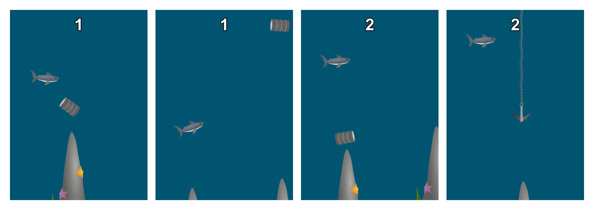

# Intro
A game I made in 24hrs as a challenge. A polished version used to promote my Robotics Team can be found [here]

# Where to Play.
- [Here on Github](http://theqyd.github.io/swimmy-shark).
- Clone it and add it to your webserver.
- Download it. Unzip it. Add it to your webserver.

# How to Play.
You are a shark. Avoid the obstacles in the ocean. It's like Flappy Bird, but worse.

# Credits.
- Code: Qasim Dove <emailqasim@gmail.com>
- Graphics: Qasim Dove <emailqasim@gmail.com>

# Misc
You can play a more polished version [here](https://github.com/TheQYD/swimmy-shark-v.2).

# License
Swimmy Shark is available under the CC0 1.0 license. See the LICENSE file for more info.
